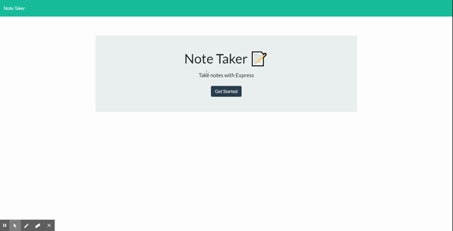

# note-taker
an application that can be used to write, save, and delete notes. This application will use an express backend and save and retrieve note data from a JSON file.


# Table of contents
1. [Usage](#Usage)
3. [Live Demo](#Live_Demo)
4. [License](#License)
5. [Features](#Features)
6. [Technology](#Technology)
7. [Credits](#Credits)
8. [Badges](#Badges)
9. [User Story](#User_Story)
10. [Business Context](#Business_Context)

<a name="Usage"></a>
## Usage
```sh
node server.js
```
<a name="Live_Demo"></a>
## Live Demo
https://afternoon-temple-54347.herokuapp.com/
<a name='License'></a>
## License
[](https://lbesson.mit-license.org/)
<a name="Features"></a>
## Features
1. keeps notes
2.  deletes notes
3.  uses stored JSON file
<a name="Technology"></a>
## Technology
1. Node JS
2. Heroku hosting platform
3.  HTML
4.  CSS
<a name="Credits"></a>
## Credits
b0rgBart3@gmail.com
<a name="Badges"></a>
## Badges
 [](https://shields.io/)

**on github:** <a href='github.com/b0rgBart3'>b0rgBart3</a>

[](https://github.com/remarkablemark)

Email: borgBart3@gmail.com
<a name="User_Story"></a>
## User Story
```sh
AS A user, I want to be able to write and save notes I WANT to be able to delete notes I've written beforeSO THAT I can organize my thoughts and keep track of tasks I need to complete
```
<a name="Business_Context"></a>
## Business Context
For users that need to keep track of a lot of information, it's easy to forget or be unable to recall something important. Being able to take persistent notes allows users to have written information available when needed.
